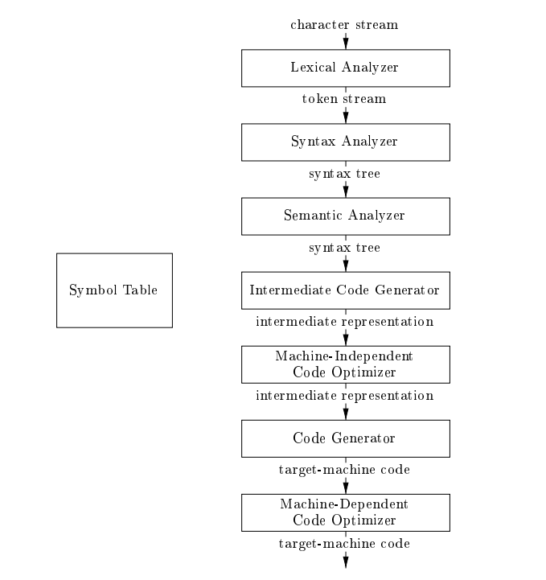

# CSE310-Compiler-Sessional

## Summary
This repository contains the codes for my undergraduate lab course <b>CSE310-Compiler Sessional</b> at <a href="https://www.buet.ac.bd/web/">BUET</a>.
 
This compiler can compile a subset of instructions of the <b>C programming language</b>. This includes arithmetic operations, array, function (including recursion), loop (while and for), if-else statements, etc.
The steps of a compiler is shown in the image below.

The image has been taken from the <a href="https://www.amazon.com/Compilers-Principles-Techniques-Tools-2nd/dp/0321486811">Dragon Book</a> by Alfred V. Aho, Monica S. Lam, Ravi Sethi, and Jeffrey D. Ullman.
 
The compiler has been implemented in <b>C++</b> and the <b>Flex</b> and <b>Bison</b> tools have been used for lexical and syntax analysis respectively.

## Description and how to run:
Each of the directory contains the solutions to the assignments of the course. Each directory includes a problem specification pdf file and some sample inputs and outputs. Each of the directories from the second to the last assignment also includes a script.sh file to run each respective program. The details of the assignments are given below.
 
<ol>
<li>The first directory "1705120_offline1 (symbolTable)" contains the solution of the first assignment</li>
    <ul>
        <li> Symbol table is the first data structure that is built in a compiler. It is used to store the identifiers and their attributes. The symbol table is implemented using a hash table. The hash table is implemented using a linked list. The hash function is implemented using the division method. The symbol table is implemented in the file "1705120.cpp". The input is taken from the file "input.txt" and the output is written in the file "output.txt".</li>
    </ul>
<li>The second directory "1705120_offline2 (lexical analyzer)" contains the solution of the second assignment</li>
    <ul>
        <li> Lexical analyzer is the first phase of a compiler. It is used to convert the input source code into a sequence of tokens. The lexical analyzer is implemented using the Flex tool. The lexical analyzer is implemented in the file "1705120.l". The input is taken from the file "input.txt. There are two output files in this assignment one is 1705120_token.txt and other is 1705120_log.txt</li>
    </ul>
<li>The third directory "1705120_offline3 (syntax and semantic)" contains the solution of the third assignment</li>
    <ul>
        <li> Syntax analyzer is the second phase of a compiler. It is used to check whether the sequence of tokens generated by the lexical analyzer is syntactically correct or not. The syntax analyzer is implemented using the Bison tool. The syntax analyzer is implemented in the file "1705120.y". The input is a "c" extension file taken from the command line. There are two output files in this assignment one is log.txt and other is error.txt</li>
    </ul>
<li>The last directory "1705120_offline4 (intermediate code)" contains the solution of the fourth assignment</li>
    <ul>
        <li> In this assignment I had to include both intermediate code generation and code optimization.</li>
        <li> Intermediate code is the third phase of a compiler. It is used to convert the source code into a sequence of instructions. The intermediate code is implemented using the Flex and Bison tools. The intermediate code is implemented in the file "1705120.l" and "1705120.y". The input is a "c" extension file taken from the command line. There are two output files in this assignment one is code.asm and other is optimized_code.asm.</li>
    </ul>
</ol>
